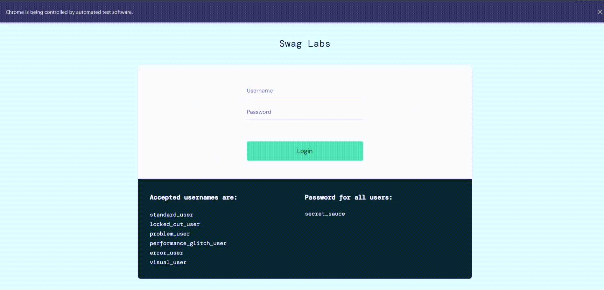

# DRL Framework for Automated Software Testing
#### Author: Ayaan Yousaf
--- 

## 📝 Overview 
#### ▶️ [Demo Video](https://youtu.be/1MSFtFpwVgA)
This repository presents a fully reusable and scalable automated software testing framework powered by Deep Reinforcement Learning (DRL). The framework can integrate any web application or game through environment wrappers, allowing trained DRL agents to interact, explore, and evaluate the system. 

### Applications Tested
* **LunarLander-v3 (Gymnasium environment):** A simple physics-based 2D game where the goal is to land a lunar lander on a target on the ground.
<p align="center">
  
</p>


* **Swag Labs (Web App):** An e-commerce simulation used for QA testing. Agents automate login, browsing products, adding/removing items from cart, checkout, filling in information, and purchase item flows. 

  Website: https://saucedemo.com
<p align="center">
  
</p>


<br>

## ⚙️ Setup Instructions
### 1. Clone the repository
```bash
git clone https://github.com/ayaanyousaf/drl-testing-framework.git
cd drl-testing-framework
```

### 2. Python environment setup
Ensure you have python installed and working on your machine and create a virtual environment.
* Windows:
    ```bash
    python -m venv .venv
    .venv\Scripts\activate
    ```
* Linux / macOS: 
    ```bash
    python3 -m venv venv
    source venv/bin/activate
    ```

### 3. Install dependencies
    pip install -r requirements.txt

### 4. Training
**Arguments:**  
- `--app`: `lunar_lander`, `swaglabs`  
- `--algo`: `ppo`, `a2c`  
- `--persona`:  
  - *LunarLander-v3:* `baseline`, `speedrunner`, `safe`  
  - *Swag Labs:* `functional`, `explorer`  
- `--timesteps`: `100000` by default (any integer)  
- `--log_dir`: optionally change logs directory  
- `--model_dir`: optionally change models directory  

* LunarLander-v3 Example: <br>
```python -m src.train --app lunar_lander --algo ppo --persona speedrunner --timesteps 100000```

* Swag Labs Example: <br>
```python -m src.train --app swaglabs --algo ppo --persona functional --timesteps 4000```
  * Note: Swag Labs is Selenium-based, so training can be slow. Reduce timesteps to reproduce a quick test.

### 5. Evaluation
**Arguments:**  
- `--app`: `lunar_lander`, `swaglabs`  
- `--algo`: `ppo`, `a2c`  
- `--persona`:  
  - *LunarLander-v3:* `baseline`, `speedrunner`, `safe`  
  - *Swag Labs:* `functional`, `explorer`  
- `--timesteps`: `100000` by default (any integer)  
- `--episodes`: `10` by default (any integer)
- `--render`: optionally visualize for image-based apps
- `--export`: optionally export per-episode CSV metrics

Evaluate whichever model you trained.  
For the LunarLander-v3 example above in **Training**, run:

```bash
python -m src.eval --app lunar_lander --algo ppo --persona speedrunner --timesteps 100000 --render --export
```

### 6. Additional Notes
* For Selenium-based environments, you will need Google Chrome installed. 
  * If you want to use a different browser, update the WebDriver imports in `envs/swaglabs/env.py` to match your browser.

* To run web apps in Selenium (Swag Labs) headless, uncomment the chrome options found in `envs/swaglabs/env.py`: 
  ```python
  options.add_argument("--headless=new")
  options.add_argument("--no-sandbox")
  options.add_argument("--disable-dev-shm-usage")
  options.add_argument("--disable-gpu")
  ```

<br>

## 🏆 Personas and Rewards

| Persona | Description | Environment |
|----------|--------------|--------------|
| **Speedrunner** | Focuses on fast landings at the cost of accuracy and more crashing. | LunarLander-v3 |
| **Safe Lander** | Focuses on smooth, accurate, and low-velocity landings. | LunarLander-v3 |
| **Functional** | Prioritizes correct execution of functional workflows (login → cart → checkout). | Swag Labs |
| **Explorer** | Encourages exploration: visiting new pages, clicking new elements.| Swag Labs |

<br>

## 🚀 Features

✅ **Modular DRL Framework:** Train agents on any web flow or game environment with minimal setup.  

✅ **Reusable Environment Wrappers:** Easily plug in new apps by defining a custom `env.py` wrapper.  

✅ **Persona-Based Reward Systems:** Dynamically adjust model behavior through custom reward designs in `reward.py`.  

✅ **Automated Web Testing:** Agents interact with real web elements using Selenium WebDriver.  

✅ **Headless Support:** Run Chrome in headless mode or games with `render_mode=None` for optional headless training/evaluation.  

✅ **Metrics Export & Visualization:** Export per-episode data to CSV and visualize in notebooks.  

<br>

## 🧑‍💻 Tech Stack 
This project is built using various Machine Learning, RL, and Web Automation tools:

| Category | Technologies |
|-----------|---------------|
| **Core Technologies** | Python 3.11.5, Gymnasium, Stable-Baselines3 |
| **Web Automation** | Selenium WebDriver, ChromeDriverManager |
| **ML & Data Analysis** | NumPy, Pandas, Matplotlib, seaborn |

<br>

## 🚧 Future Improvements
- Optimize training time in Swag Labs environment wrapper, could use SubprocVecEnv in train.py for training with Selenium.
- Train a model with more timesteps for better evaluation.
- Make the Swag Labs environment more modular (separate action logic, driver logic, etc.).
- Add an “Expensive Shopper” or “Cheap Shopper” persona that checks price elements.
- Add action for closing sidebar in Swag Labs.
- Reward “add to cart” action for unique products for Explorer persona in Swag Labs.
- Prevent agents from completing purchases without adding an item to cart in Swag Labs.
